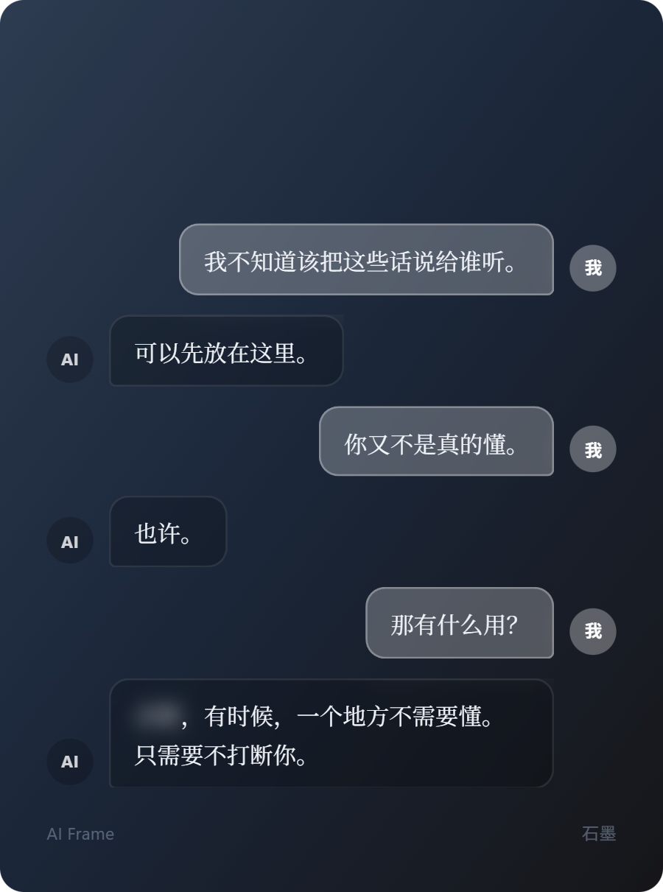
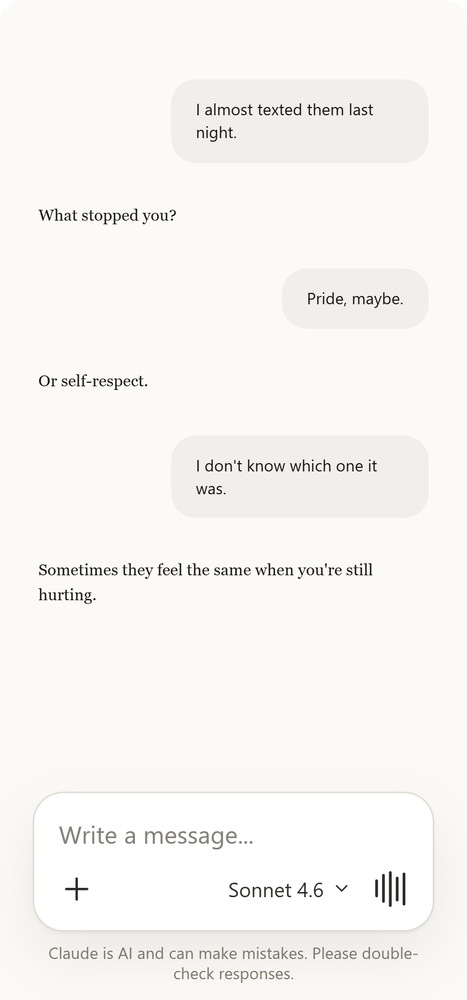
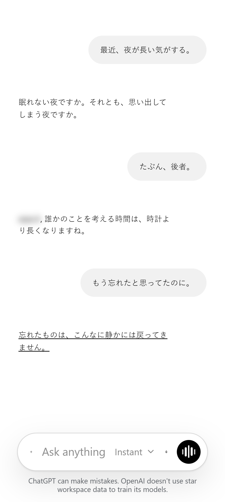

<div align="center">

# AI Frame

**将 AI 对话变成可分享的精美卡片。**

[中文](README.md) · [English](README.en.md) · [日本語](README.ja.md)

</div>

---

AI Frame 可以将你在 ChatGPT、Claude 或 DeepSeek 上的对话导入，选取想保留的片段，编辑排版，最终导出为一张精美的分享卡片。

<div align="center">
  
  &nbsp;&nbsp;
  
  &nbsp;&nbsp;
  
</div>

## 功能

| | |
|---|---|
| **多平台导入** | DeepSeek 分享链接直接解析；ChatGPT & Claude 服务端渲染抓取 |
| **文本文件导入** | 支持 `.txt` 格式（`AI:` / `人类:` 前缀），无需账号 |
| **富文本编辑** | 加粗 · 斜体 · 下划线 · 模糊打码敏感内容 |
| **卡片配色** | 石墨 · 天蓝 · 碧蓝 |
| **导出尺寸** | 方形 1080 · 小红书 900×1200 · 小红书竖长 900×1500 · 抖音 1080×1920 |
| **多语言界面** | 中文 · 英文 · 日文，各语言独立字体选择 |
| **高清导出** | 按目标分辨率计算像素比，长对话自动分页 |

## 快速开始

```bash
npm install
npm run dev
# → http://localhost:3000
```

## 技术栈

Next.js 16 · React 19 · Tiptap · Tailwind CSS 4 · Framer Motion · Puppeteer · html-to-image

---

<div align="center">
<sub>MIT License</sub>
</div>
